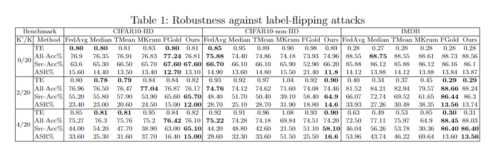
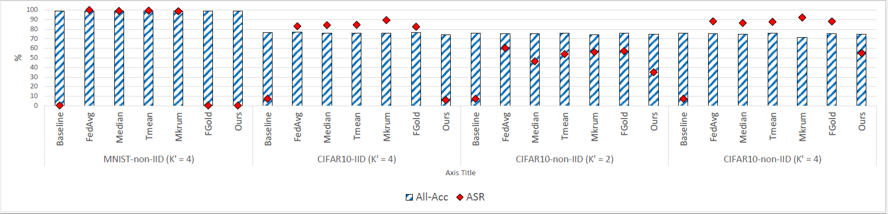
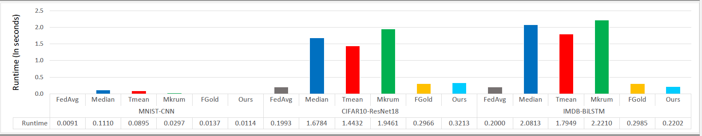

# FL-Defender: Combating Targeted Attacks in Federated Learning.
This repository contains PyTorch implementation of the paper: FL-Defender: Combating Targeted Attacks in Federated Learning.

## Paper 

[FL-Defender: Combating Targeted Attacks in Federated Learning](https://arxiv.org/abs/2207.00872)

## Content
The repository contains one jupyter notebook for each benchmark which can be used to re-produce the experiments reported in the paper for that benchmark. The notebooks contain clear instructions on how to run the experiments. 

## Data sets
[MNIST](http://yann.lecun.com/exdb/mnist/) and [CIFAR10](https://www.cs.toronto.edu/~kriz/cifar.html) will be automatically downloaded.
However, [IMDB](https://ai.stanford.edu/~amaas/data/sentiment/) requires a manual download using this [link](https://drive.google.com/file/d/1X86CyTJW77a1CCkAFPvN6pqceN63q2Tx/view?usp=sharing). 
After downloading [IMDB](https://ai.stanford.edu/~amaas/data/sentiment/), please save it as imdb.csv in the data folder inside the folder IMDB.

## Dependencies

[Python 3.6](https://www.anaconda.com/download)

[PyTorch 1.6](https://pytorch.org/)

[TensorFlow 2](https://www.tensorflow.org/)

## Results

### Robustness to label-flipping attacks

*Robustness to label-flipping attacks.*   

### Robustness to backdoor attacks

*Robustness to backdoor attacks.*   

### Runtime

*Runtime overhead per-iteration in seconds.*   

## Citation 

@article{jebreel2022fl,
  title={FL-Defender: Combating Targeted Attacks in Federated Learning},
  author={Jebreel, Najeeb and Domingo-Ferrer, Josep},
  journal={arXiv preprint arXiv:2207.00872},
  year={2022}
}

## Funding

